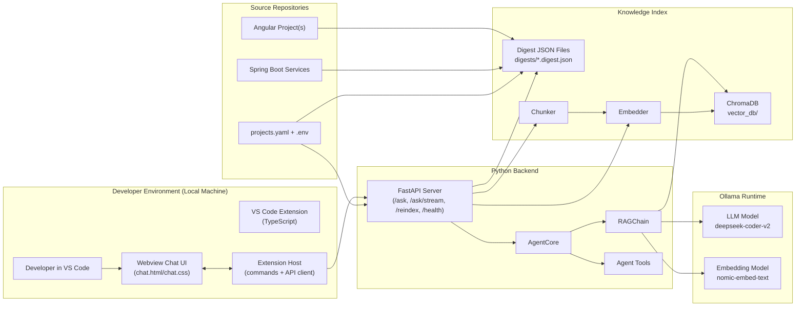
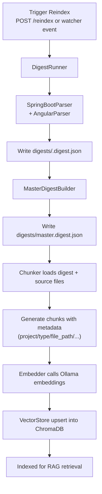
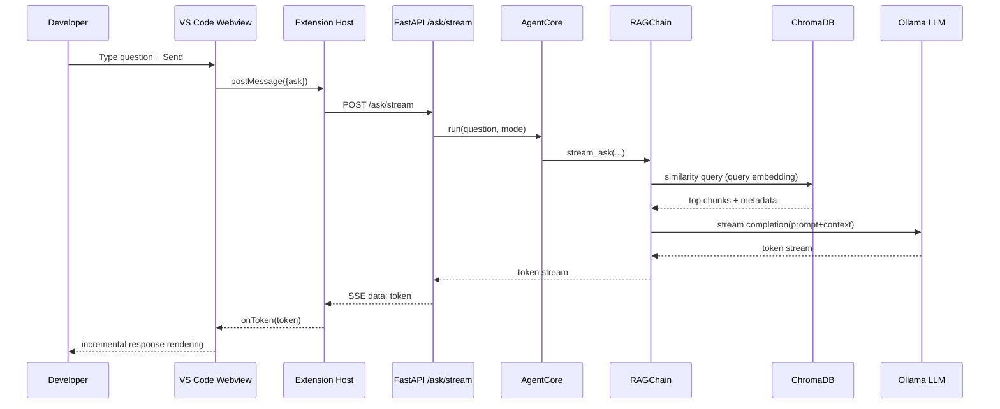
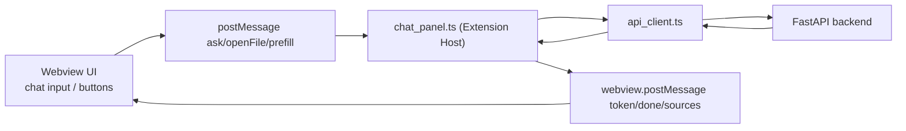
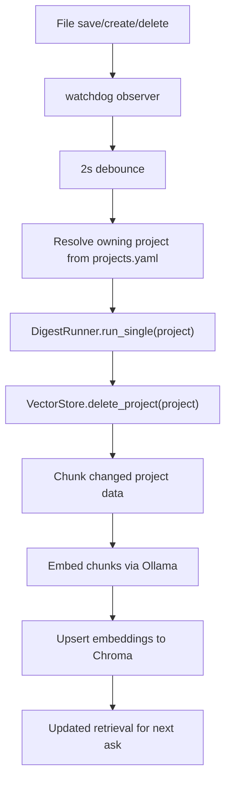

# Local AI Agent Architecture

This document explains how the system works end-to-end: what gets generated, where data is stored, and how the Python backend + Ollama + VS Code extension connect.

---

## 1) High-Level Architecture

The project is built as a multi-stage pipeline:

1. **Digest stage** (`digest/`)
   - Parses Angular + Spring Boot codebases into structured JSON summaries.
2. **Embedding stage** (`embeddings/`)
   - Converts digest + source code into chunks.
   - Creates embeddings for chunks using Ollama embedding model.
   - Stores embeddings in local ChromaDB (`vector_db/`).
3. **Agent stage** (`agent/`)
   - Retrieves relevant chunks (RAG).
   - Builds prompts and calls Ollama LLM for answers.
4. **API stage** (`api/`)
   - Exposes `/ask`, `/ask/stream`, `/reindex`, `/health`, `/digest`, `/projects`.
5. **VS Code extension stage** (`vscode-extension/`)
   - Chat UI + commands + CodeLens.
   - Calls FastAPI endpoints and streams responses.

---

## 2) Main Components and Responsibilities

### `projects.yaml`

- Registry of all local codebases to analyze.
- Defines project `name`, `type` and absolute `path`.
- `type` controls parser choice:
  - `angular` -> Angular parser
  - `spring-boot` (also aliases like `maven`, `gradle`) -> Spring parser

### `digest/` (Code Digest Engine)

Purpose: build a structured map of the codebase before embeddings.

- `project_loader.py`: loads config and maps files to owning project.
- `springboot_parser.py`: extracts endpoints, entities, DTOs, Feign calls, events, and security hints.
- `angular_parser.py`: extracts modules, components, services, routes, guards, interceptors, and model/interface names.
- `master_digest_builder.py`: creates cross-service map (contracts, dependencies, auth flow, shared models).
- `digest_runner.py`: orchestrates full/single/incremental runs and writes digest files.
- `models.py`: Pydantic schema contracts for digest objects.

### `embeddings/` (Indexing Engine)

Purpose: convert digests + source files into searchable vectors.

- `chunker.py`:
  - Creates chunks from digest files and raw code files.
  - Adds metadata (`project`, `type`, `file_path`, etc.).
  - Uses token-aware chunking via `tiktoken` when available.
  - Falls back to char-based chunking in strict offline/SSL-restricted environments.
- `embedder.py`:
  - Calls Ollama embeddings API (`nomic-embed-text` by default).
  - Adds embedding vectors to chunk records.
- `vector_store.py`:
  - Stores/retrieves vectors in Chroma collection `codebase`.
  - Supports metadata filtering and project-level delete for incremental reindex.
- `watcher.py`:
  - Watches file changes and reindexes only affected projects.

### `agent/` (RAG + Orchestration)

Purpose: answer questions/generate suggestions using retrieved context.

- `prompts.py`: system + mode-specific prompt templates.
- `tools.py`: utility functions exposed as tools (endpoint list, dependency view, auth flow, secure file read, search).
- `rag_chain.py`:
  - Embeds query.
  - Retrieves top chunks from Chroma.
  - Builds final prompt and calls Ollama LLM (`deepseek-coder-v2` by default).
  - Supports normal response and token streaming.
- `agent_core.py`:
  - Routes by mode (`chat`, `generate`, `impact`).
  - Uses mode detection heuristic when mode is omitted.
  - Uses ReAct tool path for impact analysis when available, with fallback.

### `api/` (Application Interface)

Purpose: expose the agent as HTTP endpoints.

- `server.py`:
  - `POST /ask`: standard request/response.
  - `POST /ask/stream`: SSE token streaming.
  - `POST /reindex`: runs digest + chunk + embed + upsert.
  - `GET /digest`: digest summary.
  - `GET /health`: checks Ollama + Chroma.
  - `GET /projects`: shows configured projects and path status.
- `schemas.py`: request/response models.
- `middleware.py`: request logging and latency.

### `vscode-extension/` (Developer UX)

Purpose: provide in-editor AI workflow.

- `src/extension.ts`: activation and registration.
- `src/chat_panel.ts`: webview chat panel, stream rendering, source links.
- `src/api_client.ts`: HTTP client to FastAPI.
- `src/code_actions.ts`: context menu commands.
- `src/inline_lens.ts`: CodeLens above Angular/Spring symbols.
- `media/chat.html`, `media/chat.css`: chat UI template/styling.

---

## 3) Data Artifacts: What is Created and Where

### A) Digest JSON (structured code map)

Created by: `python -m digest.digest_runner` or `/reindex`.

Location:

- `digests/<project>.digest.json`
- `digests/master.digest.json`

Contents include:

- endpoints (method/path/auth/roles)
- entities/relationships
- DTO names
- frontend service HTTP calls
- cross-service dependencies and auth flow

### B) Vector DB (semantic search index)

Created by: `POST /reindex` (or embedding pipeline usage).

Location:

- `vector_db/` (from `CHROMA_PATH`)

Contents:

- chunk documents (digest + raw code snippets)
- embeddings vectors
- metadata (project/type/file path/class/method)

### C) Runtime Memory Data

During `/ask`:

- query embedding vector (temporary)
- top retrieved chunks (temporary)
- final prompt text (temporary)
- LLM output (returned to client)

---

## 4) Digest -> Embedding -> Retrieval Lifecycle

### Step 1: Digest Creation

Parser modules walk each configured repo and produce normalized JSON summaries.

### Step 2: Chunk Generation

Chunker builds two chunk families:

- **Digest chunks**: endpoint/entity/auth/component/service summaries
- **Code chunks**: class/file/method level source segments

All chunks get deterministic IDs and metadata.

### Step 3: Embedding Generation

Each chunk text is sent to Ollama embedding model:

- default model: `nomic-embed-text`
- output: vector per chunk

### Step 4: Vector Upsert

Vectors + metadata are upserted into Chroma (`codebase` collection).

### Step 5: Query-Time Retrieval

On `/ask`:

1. User question is embedded.
2. Chroma similarity search returns top relevant chunks.
3. Chunks are formatted into prompt context.
4. Ollama LLM generates response.

---

## 5) How Ollama Is Used

Ollama is used in two places:

1. **Embedding model**
   - Called by `embeddings/embedder.py` and query-time embed in `agent/rag_chain.py`.
   - Default: `nomic-embed-text`.
2. **LLM generation model**
   - Called by `agent/rag_chain.py` for final answers.
   - Default: `deepseek-coder-v2`.

Configured via `.env`:

- `OLLAMA_HOST`
- `OLLAMA_MODEL`
- `OLLAMA_EMBED_MODEL`

Health verification:

- `GET /health` checks Ollama reachability.

---

## 6) How VS Code Extension Works

The extension is a thin client. It does not run an LLM itself.  
It delegates all AI work to the backend API (`api/server.py`), and the backend talks to Ollama.

### 6.1 Extension runtime model

There are two runtime layers:

1. **Extension Host (Node.js process)**
   - Runs TypeScript extension code (`extension.ts`, command handlers, API client).
2. **Webview (browser-like sandbox)**
   - Renders chat UI (`chat.html`/`chat.css`).
   - Sends/receives messages to/from Extension Host.

So the Webview never directly calls local files or Python backend.  
It posts messages to Extension Host, and Extension Host performs API calls.

### 6.2 Activation and registration

On startup (`src/extension.ts`):

- command handlers are registered (`localai.openChat`, `localai.explainSelection`, etc.)
- CodeLens provider is registered for `typescript` and `java`

This is how context-menu and CodeLens actions become available in the editor.

### 6.3 Chat panel lifecycle

`ChatPanel.createOrShow()`:

- creates or focuses a single webview panel
- injects HTML/CSS
- wires message bridge (`webview.onDidReceiveMessage`)

From there:

- user types prompt in webview
- webview sends `{ type: "ask", question, mode, attachFile }`
- Extension Host receives it and calls backend through `ApiClient`

### 6.4 Streaming response flow (token-by-token)

For chat responses, extension uses `POST /ask/stream`:

1. `ApiClient.askStream(...)` opens fetch stream.
2. Parses SSE frames (`data: <token>`).
3. For each token, sends message back to webview.
4. Webview appends token to active AI bubble in real time.

After stream completes, extension may call `/ask` for structured metadata (like sources).

### 6.5 File context / selection behavior

- **Explain selection**:
  - Reads selected code and active file path.
  - Sends prefilled chat prompt in `chat` mode.
- **Generate change**:
  - Prompts user for change request.
  - Can include current file content as `file_context`.
- **Impact analysis**:
  - Uses selected text (or whole file if no selection) in `impact` mode.

This means the backend can answer with awareness of active code context.

### 6.6 CodeLens behavior

`src/inline_lens.ts` scans visible document text and adds actions above:

- `@Component`, `@Injectable` (Angular)
- `@RestController`, `@Entity` (Spring)
- endpoint annotations (`@GetMapping`, etc.)

Clicking lens commands sends pre-filled questions into the same ChatPanel.

### 6.7 Re-index from VS Code

`Local AI: Re-index Codebase` command:

1. Shows progress notification.
2. Calls `POST /reindex`.
3. Backend rebuilds digest + embeddings + vector index.
4. Extension shows completion message with indexed chunk stats.

### 6.8 Data path for one chat request

End-to-end path for one question:

1. User enters prompt in webview.
2. Webview -> Extension Host message bridge.
3. Extension Host -> FastAPI (`/ask/stream`).
4. FastAPI -> `AgentCore` -> `RAGChain`.
5. `RAGChain`:
   - embeds query
   - retrieves chunks from Chroma
   - calls Ollama LLM for generation
6. Tokens stream back:
   - FastAPI SSE -> Extension Host -> Webview
7. Webview renders final answer and source references.

### 6.9 Why "model not found" appears in VS Code

Even though extension calls API, the API still needs local Ollama models.

Dependency chain:

- VS Code extension -> FastAPI API -> Ollama models

So model errors in chat typically mean:

- `OLLAMA_MODEL` in `.env` not present in `ollama list`
- or Ollama service not running

Fix:

```bash
ollama pull deepseek-coder-v2
ollama pull nomic-embed-text
ollama list
```

and keep API running from same project `.env`.

### 6.10 Extension failure boundaries

If backend is down or unreachable:

- API client catches network failures
- extension shows user-facing error message
- no direct crash of editor is expected

If backend is up but indexing is missing:

- responses may be generic/weak due to little retrieval context
- run reindex to populate `vector_db/`

---

## 7) Security Boundary and Locality

- All code/data processing is local machine based.
- `read_source_file` tool validates requested paths are inside registered project roots.
- No cloud provider is required when using Ollama locally.
- Vector data stays in local filesystem (`vector_db/`).

---

## 8) Incremental Update Model

With watcher enabled:

1. File save/create/delete event detected.
2. Owning project resolved from path.
3. Only that project is re-digested.
4. Existing vectors for that project are deleted.
5. New chunks are embedded and upserted.

Goal: avoid expensive full reindex for every change.

---

## 9) End-to-End Sequence (Typical)

1. Configure `projects.yaml`.
2. Run digest (`python -m digest.digest_runner`).
3. Start API server (`python -m uvicorn api.server:app --port 8765 --reload`).
4. Build index (`POST /reindex`).
5. Ask questions from VS Code chat or `/ask`.
6. System retrieves local context and uses Ollama to answer.

---

## 10) Key Design Principles

- **Digest-first indexing**: structured metadata improves retrieval precision.
- **Metadata-rich chunks**: enables project/type scoped retrieval.
- **Streaming UX**: VS Code chat displays token-by-token responses.
- **Mode-aware responses**: chat, generation, and impact analysis behavior differ.
- **Incremental reindexing**: reduces indexing time on active development.

---

## 11) Architecture Diagrams

### 11.1 Full System Component Diagram



### 11.2 Indexing / Reindex Pipeline Diagram



### 11.3 Chat Request + Streaming Sequence Diagram



### 11.4 VS Code Extension Internal Message Flow



### 11.5 Incremental Watcher Flow



