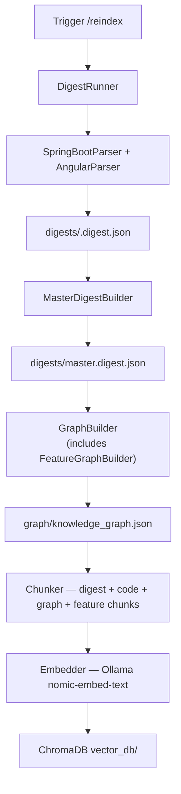
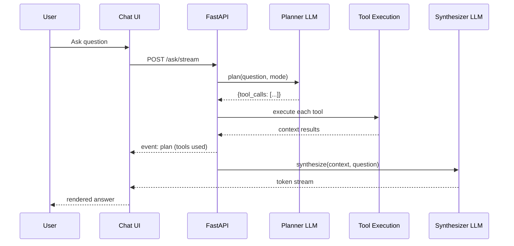

# Local AI Agent — Code Assistant

A fully local, offline AI agent for Angular + Spring Boot microservice projects. Powered by Ollama (no cloud required). Understands your entire codebase — every service, component, entity, Feign client, Kafka topic, and DB migration — and can answer questions, trace flows, analyse impact, and generate code that matches your exact patterns.

---

## Table of Contents

1. [What This System Does](#1-what-this-system-does)
2. [How It Works](#2-how-it-works)
3. [System Components](#3-system-components)
4. [Data Artifacts](#4-data-artifacts)
5. [Install and Setup](#5-install-and-setup)
6. [Configuration](#6-configuration)
7. [Running the System](#7-running-the-system)
8. [Building the Index](#8-building-the-index)
9. [Using the Chat UI](#9-using-the-chat-ui)
10. [API Reference](#10-api-reference)
11. [VS Code Extension](#11-vs-code-extension)
12. [Sample Prompts](#12-sample-prompts)
13. [Troubleshooting](#13-troubleshooting)

---

## 1. What This System Does

### Core Capabilities

| Capability | Description |
|---|---|
| **Code Q&A** | Ask anything. Get concrete answers with class names, file paths, method names. |
| **End-to-end trace** | "How does the order flow work?" → traces Angular component → service → HTTP call → controller → service bean → repository → entity → DB table |
| **Feature trace** | "How does the Book Appointment feature work?" → complete Angular-to-backend trace for any user-facing feature |
| **Impact analysis** | "What breaks if I rename the Order entity?" → BFS through the knowledge graph across all services |
| **Code generation** | "Add a cancel endpoint to OrderController" → produces unified diffs matching your code style, with an Apply button |
| **Multi-turn conversation** | Remembers context across the session. "Now add validation to that" works as expected. |
| **Diff apply** | Generated diffs can be applied to disk directly from the chat UI |

### What It Understands

**Spring Boot:**
- REST controllers (endpoints, methods, request/response DTOs, auth/roles) — including multi-line annotation args
- Service beans (`@Service`) with constructor injection dependencies and method call graphs
- Repository beans — JPA + NoSQL (`MongoRepository`, `ReactiveMongoRepository`, etc.) — with `@Query` JPQL strings **and** derived Spring Data query descriptions (`findByEsaAndProducttype` → `SELECT WHERE esa = ? AND producttype = ?`, `countByStatus` → `COUNT WHERE status = ?`)
- JPA entities (`@Entity`, fully-qualified `@jakarta.persistence.Entity`) and NoSQL documents (`@Document` for MongoDB, `@RedisHash`, `@Node` for Neo4j) — Lombok-style bare private fields, `@Column`/`@Field`, `@Id`, relationships (`OneToMany`, `@DBRef`, etc.)
- MongoDB collection name resolution: `@Document("name")`, `@Document(collection = "name")`, SpEL `@Document("base#{@environment.getProperty('key') ?: ''}")` — the property key is resolved from `application.properties` and appended (e.g. `esazonemapping` + `_dev` = `esazonemapping_dev`). Java string concatenation across lines is joined before parsing.
- DTO field structures: `OrderRequest` → all fields with types, `@NotNull`/`@Size` validations, `@JsonProperty` aliases
- Feign clients with **resolved URLs** from `application.properties` (e.g. `${ms-java.appointments.url}` → `http://ms-java-appointments:8080`) and per-method request/response types
- Exception handlers (`@ControllerAdvice`)
- Scheduled tasks (`@Scheduled` cron/fixedRate)
- Kafka/RabbitMQ events — all patterns: literal topics, `@Value("${kafka.topic}")` field references, `${prop}` placeholders in `@KafkaListener`, array format topics, static constants, Spring Cloud Stream `streamBridge.send()`
- Central Kafka event publisher pattern: one service exposes REST endpoints that call `kafkaTemplate.send()` — detected automatically and surfaced as `publishes_to` edges in the graph
- Consumer topic resolution from `spring.kafka.consumer.topic` / `spring.kafka.producer.topic` properties (no hard-coded strings required)
- Security configuration (JWT filters, permit-all paths, OAuth2)
- Build dependencies (`pom.xml` / `build.gradle`)
- DB migrations (Flyway `.sql` / Liquibase `changelog.xml`)
- Per-profile `application-*.yml` and `application.properties` config
- Java constant resolution (`SiteConstant.SITE_BASE_URL` → `/api/v1/sites`)

**Angular:**
- Modules, components (inputs, outputs, injected services, template events)
- Services with HTTP calls (method, URL, response type)
- Routes (eager and lazy-loaded), guards, interceptors (JWT detection)
- NgRx: actions, effects, selectors
- Environment config (API base URLs)

**Cross-cutting:**
- Full Angular → backend API contract map
- User Function Graph: each user-facing feature traced from Angular component to DB
- Inter-service dependency graph (Feign + Kafka edges)
- JWT auth flow (issuer service, validators, FE interceptor)

---

## 2. How It Works

```
Developer
    │
    ├── Browser chat UI  (http://localhost:8765/chat)
    └── VS Code extension  (vscode-extension/)
              │
              ▼
    FastAPI backend  (api/server.py :8765)
              │
    ┌─────────┴──────────────────────────┐
    │                                    │
    AgentCore                        GraphStore
    (agent/agent_core.py)            (graph/graph_store.py)
    │                                    │
    ├── Planner LLM call (1)         loaded from
    │   decides 2-6 tools to call    knowledge_graph.json
    │                                    │
    ├── Tool execution                   │
    │   (agent/tools.py) ───────────────►│
    │   ├── search_codebase              │
    │   ├── search_deep                  │
    │   ├── trace_request                │
    │   ├── describe_feature             │
    │   ├── list_features                │
    │   ├── find_callers                 │
    │   ├── impact_graph                 │
    │   └── get_entity_schema ...        │
    │                                    │
    └── Synthesizer LLM call (2, streaming)
              │
    ┌─────────┴───────────────────────┐
    │                                 │
Ollama LLM                    ChromaDB vector store
(deepseek-coder-v2)           ./vector_db/
(nomic-embed-text)

Knowledge graph ◄── built from ── Digest files
(graph/)                          (digests/*.digest.json)
                                        ▲
                              Digest engine
                              (digest/)
                                  ├── SpringBootParser (javalang AST + regex)
                                  ├── AngularParser    (regex + NgRx)
                                  ├── PomParser        (pom.xml / build.gradle)
                                  └── MasterDigestBuilder
```

### Request Flow (every question)

```
User question
  → Session lookup          — load conversation history
  → Planner LLM call        — decides 2–6 tools to call
  → Tool execution          — graph traversal, vector search, file reads (no LLM)
  → SSE event: plan         — sent to client (shows "Gathered via: [tools]")
  → Synthesizer LLM call    — streams answer tokens using all gathered context
  → Session save            — stored for next turn
  → Client renders markdown + diff toolbars
```

### Architecture Diagrams





---

## 3. System Components

### `digest/` — Code Understanding Engine

| File | Purpose |
|---|---|
| `springboot_parser.py` | Parses Java with `javalang` AST (regex fallback). Extracts endpoints (with Java constant resolution and multi-line annotation support), service/repository beans with method call graphs, entities, Feign clients with resolved URLs and per-method request/response types, DTO field structures, all Kafka/RabbitMQ event patterns, exception handlers, scheduled tasks. |
| `angular_parser.py` | Parses TypeScript. Extracts components (inputs, outputs, injected services, template events), services with HTTP calls, routes, NgRx features, environment URLs, interceptors. |
| `pom_parser.py` | Parses `pom.xml` / `build.gradle` for build dependencies. Scans Flyway SQL and Liquibase XML for migration summaries. |
| `master_digest_builder.py` | Cross-service map: Angular→backend API contracts, inter-service dependency graph (Feign + Kafka), JWT auth flow, shared DTOs. |
| `api_catalog_builder.py` | Generates `api-catalog/openapi.json` (OpenAPI 3.0.3 spec) and `api-catalog/api-catalog.md` (Markdown table) from all digest files. Runs automatically after every reindex. |
| `digest_runner.py` | Orchestrates full/single/incremental digest runs. Triggers graph rebuild and API catalog generation after every run. |
| `models.py` | Pydantic v2 schemas: `ServiceDigest`, `AngularDigest`, `BeanDigest`, `NgRxFeature`, `ScheduledTaskDigest`, `DtoDigest`, `DtoFieldDigest`, `FeignCallDetail`, `KafkaTopicConfig`, etc. |

### `graph/` — Knowledge Graph

| File | Purpose |
|---|---|
| `graph_builder.py` | Builds a directed property graph from all digests. Creates Spring/Angular/endpoint nodes and edges. Calls `FeatureGraphBuilder` as a final phase. Adds `inferred_http_call` edges using service name convention when URL-matching fails. |
| `feature_graph.py` | Detects user-facing features from Angular component paths (`src/app/components/<feature>/`). Creates `user_function` nodes with entry components, Angular services, and inferred backend projects. Adds `part_of_feature`, `feature_uses`, and `feature_calls` edges. |
| `graph_store.py` | Loads `knowledge_graph.json` into memory. BFS traversal tools: `trace_request`, `find_callers`, `impact_graph`, `list_features`, `describe_feature`. `trace_request` shows `[AUTH: required, roles=[...]]` on every endpoint and includes `@Query` JPQL/SQL for repository nodes. `describe_feature` includes JPQL for repository dependencies. |

**Node types:** `endpoint`, `spring_service`, `spring_repository`, `spring_component`, `spring_configuration`, `entity`, `angular_component`, `angular_service`, `kafka_topic`, `user_function`

**Edge types:** `uses_service`, `http_call`, `inferred_http_call`, `handled_by`, `depends_on`, `manages`, `jpa_relation`, `feign_calls`, `produces_event`, `consumes_event`, `publishes_to`, `part_of_feature`, `feature_uses`, `feature_calls`

### `embeddings/` — Vector Index

| File | Purpose |
|---|---|
| `chunker.py` | Converts digest JSON + source code + graph relationships + user function summaries into chunks. Semantic splitting (method-level for Java/TypeScript). Generates one feature chunk per `user_function` node summarising the complete Angular-to-DB trace. |
| `embedder.py` | Calls Ollama (`nomic-embed-text`) to vectorise each chunk. Batch processing with retries. |
| `vector_store.py` | ChromaDB wrapper. `upsert`, `query` (with metadata filters), `delete_project`. |
| `watcher.py` | `watchdog` file-system watcher. 2-second debounce then re-digests only the affected project. |

### `agent/` — Reasoning Engine

| File | Purpose |
|---|---|
| `planner.py` | LLM call #1: decides which tools to invoke. Outputs `{"reasoning": "...", "tool_calls": [...]}`. Rule-based fallback routes "end to end / module X flow" → `describe_feature`; "downstream calls" → `get_external_calls`; "what fields does X have" → `get_dto_schema`. |
| `loop.py` | Plan → Execute → Synthesize. Structural tools (graph traversal) sorted first in synthesis context; results deduplicated across tool calls by paragraph fingerprint. `_MAX_TOOL_OUTPUT=12000`. Mode-specific synthesis prompts: chat / deep / generate / impact. |
| `agent_core.py` | Public interface: `run()` and `stream_run()`. Initialises `AgentLoop` with `num_ctx=16384`, `temperature=0.15`, `top_p=0.95` for grounded, deterministic code analysis. Graceful fallback to `RAGChain`. |
| `rag_chain.py` | Fallback single-shot RAG: embed → retrieve → prompt → LLM. Multi-hop retrieval with 10 query variants and re-ranking by relevance. Same LLM parameters as the agent loop. |
| `tools.py` | All tool functions (plain Python callables). `build_tools_map()` returns `{name: fn}`. `search_deep` runs 10 targeted query variants (covers service/bean, endpoint, entity, config/Feign, Angular, method call graph, **security/auth**, **exception handling**, **Kafka/config**). `search_codebase` retrieves 16 candidates and reranks to best 8. Full tool list below. |
| `session_store.py` | Thread-safe in-memory session store. 2-hour TTL, max 200 sessions. Last 4 exchanges injected into every prompt. |
| `code_gen.py` | Parses `### FILE: [MODIFY\|CREATE]` blocks from LLM output. Applies unified diffs using system `patch` with a pure Python fallback. Path-validates against registered project roots. |

**Available agent tools:**

| Tool | Input | Use when |
|---|---|---|
| `describe_feature` | feature name (fuzzy) | "How does BookAppointmentSlotModule work end to end?" |
| `list_features` | project name or `""` | "What features does pan-portal have?" |
| `search_deep` | any query | Deep architecture/flow questions — runs 8 query variants + multi-hop |
| `search_codebase` | any query | Quick semantic search |
| `search_by_project` | `"project::query"` | Project-scoped search |
| `trace_request` | `/api/path` or `GET /api/path` | Trace endpoint Angular→DB |
| `find_callers` | class name or path | "Who calls OrderService?" |
| `impact_graph` | class or entity name | "What breaks if I change X?" |
| `get_method_calls` | `ClassName` or `service::ClassName` | Service method call graph + derived Spring Data query descriptions |
| `get_method_implementation` | `ClassName::methodName` or `ClassName` | **Actual Java source code** of a method — reads source file directly, not just call graphs |
| `get_dto_schema` | DTO class name | "What fields does OrderRequest have?" |
| `get_external_calls` | service name or `""` | "What does ms-java-order call downstream?" |
| `get_all_endpoints` | service name | List all endpoints + beans for a service |
| `get_entity_schema` | entity class name | JPA entity fields and relationships |
| `get_api_contracts` | `""` | Angular→backend API contract map |
| `get_service_dependencies` | `""` | Inter-service dependency tree |
| `trace_event_flow` | kafka topic name | "How does the order.created event flow? Who produces and consumes it?" |
| `get_auth_flow` | `""` | JWT auth flow summary |
| `read_source_file` | absolute file path | Read raw source file |
| `graph_summary` | `""` | Knowledge graph statistics |

### `api/` — HTTP Layer

| File | Purpose |
|---|---|
| `server.py` | FastAPI app. All HTTP endpoints. Manages session store and graph store lifecycle. Handles SSE streaming with plan/session/done events. |
| `schemas.py` | Pydantic request/response models: `AskRequest`, `AskResponse`, `ApplyRequest`, `ApplyResponse`. |
| `static/chat.html` | Single-file browser chat UI. Markdown (marked.js) + syntax highlighting (highlight.js), diff renderer with Apply/Copy buttons, session persistence, plan strip showing tools used, **📋 Prompts panel** (50 structured prompts across 8 categories). |

---

## 4. Data Artifacts

The system generates these directories at runtime. All are safe to delete and regenerate.

### `digests/` — Structured Code Maps

Created by: `python -m digest.digest_runner` or `POST /reindex`

| File | Contents |
|---|---|
| `digests/<project>.digest.json` | Per-project structured map: endpoints (with resolved paths), beans (with method call graphs), entities (fields including Lombok-style), DTO schemas (field types, validations, `@JsonProperty`), Feign clients (with resolved URLs + per-method request/response types), events (all Kafka patterns), exception handlers, scheduled tasks, migrations |
| `digests/master.digest.json` | Cross-service map: Angular→backend API contracts, inter-service dependency graph, JWT auth flow, shared DTOs, `kafka_event_flow` (topic→producers+consumers across all services) |

**`KafkaTopicConfig` (new, per service):**
Each service's digest now includes a `kafka_topics` list. Each entry records:
- `topic_name` — resolved topic string (from literal, `@Value`, or property file)
- `role` — `producer` or `consumer`
- `class_name` / `method_name` — where in the code the topic is used
- `publisher_endpoint` — for the central publisher pattern: the REST endpoint path that triggers the `kafkaTemplate.send()` call

`MasterDigest.kafka_event_flow` is a cross-service map `{topic → {producers: [...], consumers: [...]}}` aggregated from all service digests.

**Key additions in `FeignClientDigest`:**
- `resolved_url` — actual URL resolved from `application.properties` (e.g. `http://ms-java-appointments:8080`)
- `url_property_key` — the property key used (e.g. `ms-java.appointments.url`)
- `call_details` — per-method detail: HTTP method, path, `request_dto`, `response_dto`, path params

**`DtoDigest` / `DtoFieldDigest` (new):**
Each DTO class gets a structured schema with field names, Java types, required status, `@JsonProperty` aliases, and validation annotations (`@NotNull`, `@Size`, etc.).

### `graph/knowledge_graph.json` — Knowledge Graph

Created by: graph builder (runs automatically after digest)

A directed property graph connecting every artifact across all projects:

```
angular_component::pan-portal::OrderSummaryComponent
  --[uses_service]--> angular_service::pan-portal::OrderService
    --[inferred_http_call]--> bean::ms-java-order::OrderServiceImpl

user_function::pan-portal::cancel-order
  --[part_of_feature]--> angular_component::pan-portal::CancelSummaryComponent
  --[feature_uses]--> angular_service::pan-portal::OrderService
  --[feature_calls]--> bean::ms-java-order::OrderServiceImpl

endpoint::ms-java-order::POST::/api/orders
  --[handled_by]--> bean::ms-java-order::OrderServiceImpl
    --[depends_on]--> bean::ms-java-order::OrderRepository
      --[manages]--> entity::ms-java-order::Order

bean::ms-java-order::OrderServiceImpl
  --[feign_calls]--> endpoint::ms-java-product::GET::/api/products/{id}
  --[produces_event]--> kafka_topic::order.created

endpoint::ms-java-events::POST::/api/events/order-created
  --[publishes_to]--> kafka_topic::order.created
    --[consumes_event]--> bean::ms-java-order::OrderEventConsumer
```

**User Function nodes** (`user_function` type) represent user-facing features detected from Angular component paths. Each captures the complete stack: entry components → Angular services → backend microservices.

### `vector_db/` — ChromaDB Vector Index

Created by: `POST /reindex`

Contains vectorised chunks with metadata. Chunk types indexed:

| Chunk type | Description |
|---|---|
| `endpoint` | REST endpoint: method, path, auth, roles, handler |
| `bean` | Spring bean: type, dependencies, methods, method call graph, JPQL queries |
| `entity` | JPA entity: fields, relationships, table name |
| `dto_schema` | DTO field structure: field names, types, required status, validations, `@JsonProperty`, Feign call cross-references |
| `angular_service` | Angular service: HTTP calls with resolved URLs |
| `component` | Angular component: inputs, outputs, injected services |
| `user_function` | Feature summary: entry components → services → backend → repos (one chunk per feature) |
| `graph_nodes` | Graph relationship chunk for each connected node |
| `graph_features` | Feature-level graph chunk (separate namespace from graph_nodes) |
| `migration` | DB migration summary |
| `ngrx` | NgRx actions, effects, selectors |

### `api-catalog/` — OpenAPI Catalog

Created by: automatically after every `POST /reindex`

| File | Contents |
|---|---|
| `api-catalog/openapi.json` | OpenAPI 3.0.3 spec — all REST endpoints across all services, path parameters, request/response schemas (with real field definitions from DTO parsing), `bearerAuth` security scheme, roles as `x-roles`, Feign downstream clients as `x-feign-clients` per tag. Load directly into Swagger UI or Postman. |
| `api-catalog/api-catalog.md` | Markdown table — one section per service listing endpoints (method, path, auth, roles, handler, request DTO) and a downstream Feign clients table showing resolved URLs, property keys, and per-method request/response types. |

Access via API:
- `GET /api-catalog` — returns `openapi.json`
- `GET /api-catalog/markdown` — returns `api-catalog.md` as plain text

---

## 5. Install and Setup

### Prerequisites

| Requirement | Version | Notes |
|---|---|---|
| Python | 3.11 or 3.12 | Avoid 3.14 — ecosystem compatibility issues |
| Ollama | latest | [ollama.com](https://ollama.com) |
| `patch` | system | Pre-installed on macOS/Linux; needed by `/apply` |
| Node.js | 18+ | Only for the VS Code extension |

---

### Step 1 — Install Ollama

**macOS:**
```bash
brew install ollama
```

**Linux:**
```bash
curl -fsSL https://ollama.com/install.sh | sh
```

Start the daemon (keep running in its own terminal):
```bash
ollama serve
```

---

### Step 2 — Pull the Required Models

```bash
# Main LLM — planning, Q&A, code generation (~9 GB)
ollama pull deepseek-coder-v2

# Embedding model — vectorises code chunks (~274 MB)
ollama pull nomic-embed-text

ollama list    # confirm both appear
```

> **Low VRAM?** Use a lighter model:
> ```bash
> ollama pull qwen2.5-coder:7b    # ~4 GB, good quality
> ollama pull codellama:13b        # ~8 GB
> ```
> Then set `OLLAMA_MODEL=qwen2.5-coder:7b` in your `.env`.

---

### Step 3 — Create the Python Virtual Environment

```bash
cd local-ai-agent

python3.11 -m venv .venv

# macOS / Linux
source .venv/bin/activate

# Windows
.venv\Scripts\activate

pip install --upgrade pip setuptools wheel
pip install -r requirements.txt
```

All subsequent commands assume the virtual environment is active.

---

### Step 4 — Create the `.env` File

```bash
cp .env.example .env
```

The defaults work for a standard local setup. Review:

```env
OLLAMA_HOST=http://localhost:11434
OLLAMA_MODEL=deepseek-coder-v2
OLLAMA_EMBED_MODEL=nomic-embed-text
CHROMA_PATH=./vector_db
DIGESTS_PATH=./digests
PROJECTS_CONFIG=./projects.yaml
API_PORT=8765
LOG_LEVEL=INFO
TIKTOKEN_CACHE_DIR=./tiktoken_cache
```

> **Do not change `OLLAMA_EMBED_MODEL` after your first index.** Vectors are tied to the embedding model — switching requires deleting `vector_db/` and re-indexing from scratch.

---

### Step 5 — Register Your Projects in `projects.yaml`

Replace placeholder paths with **absolute paths** to your actual codebases:

```yaml
workspace: /Users/yourname/projects    # informational only

projects:
  frontend:
    - name: fe-app
      type: angular
      path: /Users/yourname/projects/fe-app

  services:
    - name: order-service
      type: spring-boot
      path: /Users/yourname/projects/order-service

    - name: user-service
      type: spring-boot
      path: /Users/yourname/projects/user-service
```

**Rules:**
- `name` — short, no spaces. Used in tool calls and digest filenames.
- `type` — `angular` or `spring-boot` (also accepts `spring`, `maven`, `gradle`)
- `path` — **absolute** path that **exists on disk**

---

### Step 6 — Start the API Server

```bash
python -m uvicorn api.server:app --host 0.0.0.0 --port 8765 --reload
```

Expected output:
```
INFO:     Uvicorn running on http://0.0.0.0:8765
INFO:     Application startup complete.
```

Leave running. Open a new terminal for the next step.

---

### Step 7 — Build Digests, Graph, and Embeddings

```bash
curl -X POST http://localhost:8765/reindex \
  -H "Content-Type: application/json" \
  -d "{}"
```

This single command runs the full pipeline:
1. Parses every registered project into structured JSON digests
2. Builds the cross-service knowledge graph (including User Function nodes)
3. Chunks all digest data + source code + graph relationships + feature summaries
4. Embeds each chunk using `nomic-embed-text`
5. Stores vectors in ChromaDB

Wait for the response — can take **2–15 minutes** depending on codebase size:

```json
{
  "status": "ok",
  "projects_indexed": ["fe-app", "order-service"],
  "chunks_created": 3842,
  "duration_ms": 47231
}
```

---

### Step 8 — Verify Everything Works

```bash
# Ollama + ChromaDB must both show true
curl http://localhost:8765/health

# All projects should show exists=true
curl http://localhost:8765/projects

# Knowledge graph statistics
curl http://localhost:8765/graph/summary
```

Then open `http://localhost:8765/chat` and ask:
- `"What services are in this system?"` — tests basic RAG
- `"How does GET /api/orders work?"` — tests graph trace
- `"What features does the frontend have?"` — tests user function graph
- `"What breaks if I change the User entity?"` — tests impact analysis

---

## 6. Configuration

### `.env` Reference

| Variable | Default | Description |
|---|---|---|
| `OLLAMA_HOST` | `http://localhost:11434` | Ollama API URL |
| `OLLAMA_MODEL` | `deepseek-coder-v2` | LLM for Q&A and generation. Initialised with `num_ctx=16384`, `temperature=0.15`, `top_p=0.95` (hardcoded in `agent/agent_core.py`) |
| `OLLAMA_EMBED_MODEL` | `nomic-embed-text` | Embedding model — do not change after first index |
| `CHROMA_PATH` | `./vector_db` | ChromaDB directory (auto-created) |
| `DIGESTS_PATH` | `./digests` | Digest output directory (auto-created) |
| `PROJECTS_CONFIG` | `./projects.yaml` | Path to projects registry |
| `API_PORT` | `8765` | FastAPI server port |
| `LOG_LEVEL` | `INFO` | Python logging level (`DEBUG`, `INFO`, `WARNING`) |
| `TIKTOKEN_CACHE_DIR` | `./tiktoken_cache` | Cache for tiktoken tokeniser files |

### `projects.yaml` Reference

```yaml
workspace: /path/to/workspace

projects:
  frontend:
    - name: <project-name>       # unique, no spaces
      type: angular
      path: /absolute/path       # must exist on disk

  services:
    - name: <service-name>
      type: spring-boot
      path: /absolute/path
      port: 8080                 # optional, informational
```

---

## 7. Running the System

### Start the API Server

```bash
source .venv/bin/activate
python -m uvicorn api.server:app --host 0.0.0.0 --port 8765 --reload
```

### Optional: Start the File Watcher

Re-indexes a project automatically when you save a file:

```bash
# In a separate terminal (venv active)
python -m embeddings.watcher
```

The watcher debounces 2 seconds after the last change, then re-digests and re-embeds only the affected project.

---

## 8. Building the Index

### Full Reindex

```bash
curl -X POST http://localhost:8765/reindex
```

Runs digest + knowledge graph + embedding for all registered projects.

### Single Project Reindex

```bash
curl -X POST http://localhost:8765/reindex \
  -H "Content-Type: application/json" \
  -d '{"project": "order-service"}'
```

### Digest Only (no embedding)

```bash
python -m digest.digest_runner
```

Writes `digests/*.digest.json` and `graph/knowledge_graph.json`. Does not update ChromaDB.

### Verify the Index

```bash
curl http://localhost:8765/health
curl http://localhost:8765/digest
curl http://localhost:8765/graph/summary
```

Expected graph summary output:
```
Knowledge Graph: 1200+ nodes, 2000+ edges
Node types: angular_component=211, angular_service=61, user_function=30,
            endpoint=400+, spring_service=130, ...
Edge types: uses_service=253, part_of_feature=200+, feature_calls=80+,
            inferred_http_call=50+, depends_on=81, ...
```

---

## 9. Using the Chat UI

Open `http://localhost:8765/chat` in your browser.

### Interface

```
┌──────────────────────────────────────────────────────────────┐
│ Mode: [chat▼]  [📋 Prompts]  [Health]  [New Session]  …     │
├──────────────────────────────────────────────────────────────┤
│                                                              │
│  You: How does the Book Appointment feature work?            │
│                                                              │
│  ┌──────────────────────────────────────────────────────┐   │
│  │ Gathered via: [describe_feature] [search_deep]        │   │
│  │                                                      │   │
│  │ Book Appointment Slot is a user function in pan-     │   │
│  │ portal. Entry: BookAppointmentSlotComponent → uses    │   │
│  │ AppointmentsService → ms-java-appointments →          │   │
│  │ AppointmentServiceImpl → AppointmentsRepository...   │   │
│  └──────────────────────────────────────────────────────┘   │
│                                                              │
├──────────────────────────────────────────────────────────────┤
│ [textarea]                                                   │
│ [Send]  [Reindex]  Ctrl+Enter sends                         │
└──────────────────────────────────────────────────────────────┘
```

### 📋 Sample Prompts Panel

Click the **📋 Prompts** button to open a slide-in panel with 50 ready-to-use prompt templates across 8 categories:

| Category | Mode | Examples |
|---|---|---|
| 🏗️ Architecture | chat | Platform overview, service deep dive, auth flow, data model |
| 🔁 End-to-End Flows | deep | Feature trace, module trace, endpoint trace, Kafka event flow |
| ⚡ Impact Analysis | impact | Entity/DTO/endpoint change blast radius, shared module impact |
| 📋 API & Schema | chat | DTO field structure, Feign client details, auth-required endpoints |
| 🎯 Solution Design | deep | New feature design, entity design, event-driven integration |
| ⚙️ New Feature / AC | generate | New endpoint, Feign client, CRUD, validation, Kafka publisher, tests |
| 🔍 Debugging | deep/chat | Root cause, error handling, Feign failure, missing data |
| 📖 Code Review | chat | Explain a class, method call graph, controller walkthrough |

Clicking a prompt: fills the textarea, sets the correct mode, and selects the first `[PLACEHOLDER]` so you can type the real value immediately. Press `Escape` to dismiss.

### Modes

| Mode | Best for | Example |
|---|---|---|
| **chat** | General questions, explanations | "What does UserService do?" |
| **deep** | Architecture traces, root cause | "Walk me through the auth flow end to end" |
| **generate** | Writing new code | "Add a cancel endpoint to OrderController" |
| **impact** | Risk analysis before changes | "What breaks if I change the Order entity?" |

Mode is auto-detected from your question if left on `chat`. Switch manually for best results.

### Generated Code — Apply Button

When the agent generates code in **generate** mode:
- **Diff blocks** (`--- a/` / `+++ b/` format): show the target file + an **Apply** button
- **All blocks**: **Copy** button

Clicking **Apply** sends the diff to `POST /apply`. The server validates the path is inside a registered project root before writing. Shows `✓ Applied` or `✗ Failed` with the error.

### Session Management

- Session ID persists across page reloads (stored in `localStorage`)
- Last 4 exchanges injected into every LLM prompt
- Click **New Session** to start fresh
- Sessions expire after 2 hours of inactivity
- `Ctrl+Enter` (or `Cmd+Enter`) sends the message

---

## 10. API Reference

Base URL: `http://localhost:8765`

### Chat

| Method | Endpoint | Description |
|---|---|---|
| `POST` | `/ask` | Single-shot question → JSON answer |
| `POST` | `/ask/stream` | Streaming question → SSE token stream |
| `DELETE` | `/session/{id}` | Clear a conversation session |

**`POST /ask` body:**
```json
{
  "question": "How does order creation work?",
  "mode": "deep",
  "session_id": "abc-123",
  "file_context": "optional current file content"
}
```

**`POST /ask/stream` SSE event sequence:**
```
event: session
data: <session-uuid>

event: plan
data: {"reasoning":"...","tools":["describe_feature","search_deep"]}

data: <token>
data: <token>
...

event: done
data: <session-uuid>
```

### Code Apply

| Method | Endpoint | Description |
|---|---|---|
| `POST` | `/apply` | Apply a unified diff to registered project files |
| `POST` | `/apply/file` | Create or overwrite a file with full content |

### Indexing

| Method | Endpoint | Description |
|---|---|---|
| `POST` | `/reindex` | Runs digest + embed + vector upsert (all or one project) |

```json
{ "project": "order-service" }    // optional — omit to reindex all
```

### Knowledge Graph

| Method | Endpoint | Description |
|---|---|---|
| `GET` | `/graph` | Full graph JSON |
| `GET` | `/graph/summary` | Node/edge count statistics |
| `GET` | `/graph/trace?q=/api/orders` | End-to-end request trace |
| `GET` | `/graph/callers?q=OrderService` | Find callers of a class/endpoint |
| `GET` | `/graph/impact?q=Order` | BFS impact analysis |

### API Catalog

| Method | Endpoint | Description |
|---|---|---|
| `GET` | `/api-catalog` | OpenAPI 3.0.3 JSON spec — all endpoints, schemas, Feign clients |
| `GET` | `/api-catalog/markdown` | Markdown endpoint table (plain text) |

### System

| Method | Endpoint | Description |
|---|---|---|
| `GET` | `/health` | Ollama + ChromaDB status |
| `GET` | `/digest` | Digest summary (project count, endpoints, entities) |
| `GET` | `/projects` | Registered projects from `projects.yaml` |
| `GET` | `/chat` | Browser chat UI |

---

## 11. VS Code Extension

The extension provides in-editor chat, CodeLens, and right-click commands. It is a thin client — all AI work runs in the backend.

### Build and Install

```bash
cd vscode-extension
npm install
npm run compile

# Install into VS Code
code --install-extension local-ai-agent-0.1.0.vsix
# Or: Extensions panel → "..." → Install from VSIX
```

### Available Commands (`Ctrl+Shift+P`)

| Command | Description |
|---|---|
| `Local AI: Open Chat` | Opens the chat panel |
| `Local AI: Explain This` | Explains the selected code (right-click menu) |
| `Local AI: Generate Change` | Prompts for a change request on the current file |
| `Local AI: Impact Analysis` | Impact analysis on the selected code |
| `Local AI: Re-index Codebase` | Triggers a full reindex |

### CodeLens

Clickable actions appear above:
- `@RestController`, `@GetMapping`, `@PostMapping`, etc. → "Explain this endpoint"
- `@Entity` → "Show entity relationships"
- `@Component`, `@Injectable` (Angular) → "Explain this component/service"

The extension connects to `http://localhost:8765` by default. The API server must be running before opening the chat panel.

---

## 12. Sample Prompts

> The chat UI has a built-in **📋 Prompts** panel with 50 ready-to-use templates. Click the button in the toolbar — no need to type these from scratch.

### Understanding the System

```
What services make up this platform and what is each one responsible for?

What APIs does the Angular frontend call and which backend services do those calls land on?

What features does pan-portal expose to users?
```

### API & Schema Investigation (use `chat` mode)

```
What does the AppointmentSlotRequest look like? Show all fields, types, required status, and validations.

What endpoints does ms-java-appointments expose? Show auth requirements and request/response DTOs.

What does AppointmentsFeignClient call in ms-java-appointments? Show the resolved URL, all endpoints, request and response types.

What does ms-java-order call downstream? Show all Feign clients with resolved URLs and mapped endpoints.
```

### Feature Traces (use `deep` mode)

```
How does the Book Appointment feature work end to end?

How does the Cancel Order flow work? Which Angular components, services, and backend services are involved?

Walk me through the complete flow from when a customer submits a new order through to provisioning.

How does address validation work? Trace from the Angular form through to the backend validation logic.

How does identity and authentication work? Walk through token issuance, validation, and how tokens reach downstream services.
```

### Impact Analysis (use `impact` mode)

```
What breaks if I add a new required field to the Customer entity? Which services, Angular components, and API contracts need to change?

If I rename the /api/appointments endpoint, what else needs to change? Which Feign clients and Angular services call it?

What breaks if the JWT token structure changes — specifically if I add a new claim?

What is the blast radius of a schema change to the Site entity? How many services reference site data?

If I refactor the shared security module, which microservices import it?
```

### Code Generation (use `generate` mode)

```
Add a cancel endpoint to OrderController. Follow the existing controller and service patterns.

Create a new Feign client in ms-java-order to call the product-inventory service's availability check endpoint.

Add a Kafka event publisher that fires an order.cancelled event when an order is cancelled.

Add pagination support to the customer list endpoint. Follow the Spring Data Pageable pattern used elsewhere in this codebase.

Create a new Angular service to call the support-request API. Follow the existing service and HTTP call patterns. Include the TypeScript model.
```

### Kafka Event Flows (use `deep` mode)

```
Trace the order.created event. Which REST endpoint publishes it and which services consume it?

What Kafka topics does this platform produce and consume? Show the full event flow across all services.

Which service owns the central Kafka publisher? What topics does it expose via REST?

What downstream effects happen when a site.updated event is published?
```

### Debugging and Investigation

```
Why might an appointment booking fail silently? What error handling exists and what gets logged?

Where is the JWT token validated before reaching the business logic? Show the full filter chain.

What happens when a Feign call fails in ms-java-order? Is there a circuit breaker or retry?
```

---

## 13. Troubleshooting

### `"ollama": false` in health check

```bash
ollama serve            # start if not running
ollama list             # verify both models are present
ollama pull deepseek-coder-v2
ollama pull nomic-embed-text
```

### Empty or irrelevant answers

The index is empty or stale.

```bash
curl -X POST http://localhost:8765/reindex
```

Or click **Reindex** in the chat UI.

### `"exists": false` for a project in `/projects`

The path in `projects.yaml` is wrong for this machine. Fix the absolute path then restart the server.

### `graph not built` message in chat

Reindex first. The knowledge graph builds as part of the reindex pipeline.

### `apply` returns error: path not inside project

The LLM generated a path that doesn't match your project structure. Check that the path prefix in the diff matches the registered project `name` in `projects.yaml`. Manual alternative:

```bash
patch -p1 < changes.patch
```

### `javalang` parse failures

Some Java 17+ syntax (records, sealed classes, text blocks, switch expressions) may cause `javalang` to fail. The parser automatically falls back to regex — no action needed, but coverage may be reduced for those files.

### Changing the embedding model

Delete `vector_db/` and reindex from scratch — embedding dimensions differ between models and cannot be mixed.

```bash
rm -rf vector_db/
curl -X POST http://localhost:8765/reindex
```

### High memory usage / slow responses

`deepseek-coder-v2` requires ~16GB VRAM. For lower-spec machines:

```bash
ollama pull qwen2.5-coder:7b    # ~4 GB VRAM
```

Set `OLLAMA_MODEL=qwen2.5-coder:7b` in `.env` and restart the server.

### Port conflict

```bash
python -m uvicorn api.server:app --port 9000
# Open http://localhost:9000/chat
```

### `No module named ollama` / `No module named langchain_community`

Activate the virtual environment before starting:

```bash
source .venv/bin/activate
pip install -r requirements.txt
python -m uvicorn api.server:app --port 8765 --reload
```

### Tiktoken SSL error (corporate network / offline)

Download the tiktoken cache file manually and place it in `tiktoken_cache/`:

```
tiktoken_cache/26b9c229141b3d34dcac6d3728f94f1e40abb67ef4a84ca1351abc0a20e6b701
```

Set in `.env`:
```env
TIKTOKEN_CACHE_DIR=./tiktoken_cache
```

### Clean reinstall

```bash
deactivate 2>/dev/null || true
rm -rf .venv vector_db/ digests/ graph/knowledge_graph.json
python3.11 -m venv .venv
source .venv/bin/activate
pip install --upgrade pip setuptools wheel
pip install -r requirements.txt
curl -X POST http://localhost:8765/reindex   # after starting server
```
